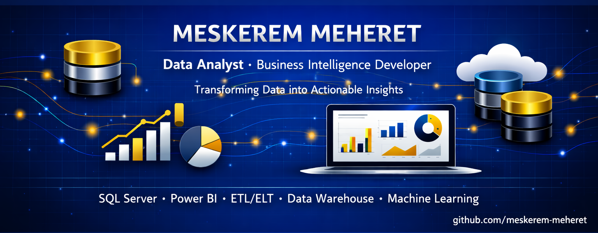

  

<h2>Hi, I'm Meskerem! 👋</h2>

<b>Data Analyst | SQL | Power BI | ETL/ELT | Data Warehouse | Business Intelligence Developer</b>

<em>
🌟 Passionate about transforming data into actionable insights and building reports & intelligent dashboards for banking and business analytics.
</em>

 

<em>
🎓 Currently pursuing my Master's at <b>St. Mary University</b> and working as a <b>Data Analyst at Tsedey Bank S.C.</b>
</em>

<h2>🧠 Technical Skills</h2>

<h4>🔹 Data Engineering</h4>

  
  
  
  
  
  

<h4>🔹 Business Intelligence & Visualization</h4>

  
  
  
  
  
  
  

## 📊 Featured Projects

| Project | Description | Tech Stack | Repository |
|----------|-------------|------------|------------|
| 🚗 **Car Sales Dashboard** | Interactive Power BI dashboard analyzing vehicle sales performance, customer preferences, and business trends | Power BI, Data Analysis |  |
| 👥 **HR Analytics Dashboard** | HR data analysis dashboard providing insights into employee trends and workforce metrics | Power BI |  |
| 📈 **Data Analytics Portfolio** *(Coming Soon)* | Collection of data analysis projects using SQL, Python, and visualization techniques | SQL, Python, Power BI | 🚧 Coming Soon |

---

## 🎓 Certifications

View my professional certifications and learning achievements:

--

### 🌱 Currently Learning

---

## 📈 GitHub Activity

<table>
  <tr>
    <td>
      
    </td>
    <td>
      
    </td>
  </tr>
</table>

---
### 🌐 Connect With Me

---

